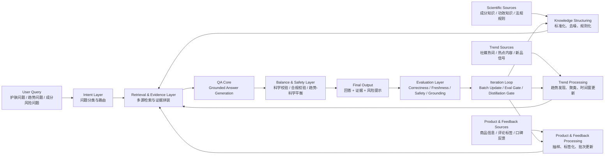

# Proposal 技术路线图草稿

## 1. 课题一句话定义
- 本项目研究一个面向美妆护肤场景的检索增强问答系统，用专业知识与合规规则保证科学正确性，用社媒趋势信号提升时效性，从而缓解“科学底线”与“趋势新鲜度”之间的冲突。

## 2. 主技术路线图

## 3. 图解说明

### 3.1 输入层
- 用户输入不是泛问题，而是美妆护肤场景下的具体 QA。
- 典型问题包括：
- 某个成分是否安全
- 某类护肤趋势是否值得跟
- 某个爆款说法是否有科学依据

### 3.2 双源数据层
- 一条线是 `Scientific Sources`，负责提供正确性和安全边界。
- 一条线是 `Trend Sources`，负责提供时效性和市场变化信号。
- 另外用 `Product & Feedback Sources` 连接真实商品和用户反馈，避免系统只停留在知识层。

### 3.3 处理中间层
- `Knowledge Structuring` 负责把成分、法规、功效信息转成可检索证据。
- `Trend Processing` 负责把社媒趋势从原始热点信号转成可用趋势主题。
- `Product & Feedback Processing` 负责把商品与口碑反馈转成稳定 batch。

### 3.4 QA 核心层
- 先做问题分类，再做多源检索。
- 不是直接让模型自由生成，而是先找证据，再回答。
- 这一层体现的是 `retrieval-grounded QA`，不是泛生成模型。

### 3.5 平衡层
- 这是本课题的关键增量。
- 不是只回答“最近流行什么”，也不是只回答“文献怎么说”。
- 而是在趋势热度、科学依据、风险约束之间做平衡。

### 3.6 评测与迭代层
- 输出之后要看四类指标：
- `correctness`
- `freshness`
- `safety`
- `grounding`
- 评测结果反过来驱动下一轮 batch 更新与蒸馏门禁。

## 4. 导师视角下这张图回答了什么
- 业务域是什么：美妆护肤问答
- 技术域是什么：检索增强问答 + 趋势信号融合 + 合规约束
- 核心矛盾是什么：科学正确性与趋势时效性的冲突
- 增量价值是什么：不是单源 QA，而是双源融合并加安全平衡层

## 5. 分享时可直接讲的版本
- 我们这次不做泛推荐，而是做一个更具体的美妆护肤 QA 系统。
- 系统面对的核心问题是：专业知识很准确，但更新慢；社媒趋势很快，但不可靠。
- 所以我们的技术路线是，把科学知识、趋势信号和商品反馈三类数据先结构化，再做检索增强问答。
- 在回答生成前后加入科学和合规校验，让系统既接得住趋势，又守得住底线。
- 最后用正确性、时效性、安全性和证据支撑度四类指标来评测，并反过来驱动下一轮数据更新。

## 6. Proposal 里建议配套出现的图文关系
- 图前：先用一段话定义课题对象和核心冲突
- 图中：突出双源输入、QA 核心、平衡层、评测层
- 图后：用 4 个 bullet 解释输入、方法、输出、评测

## 7. 当前建议
- proposal 里建议只放这一张主路线图
- 如果需要第二张图，再补一张更轻量的模块图即可
- 不建议在 proposal 阶段放过多工程部署细节
