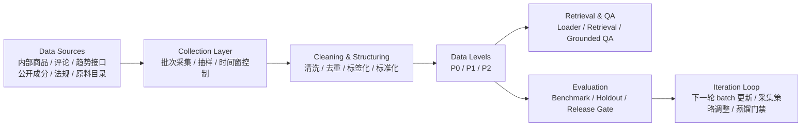

# 数据准备母稿

## 0. 汇报目标
- 本次汇报不再扩展场景，而是集中说明：我们是否已经具备支撑 `QA` 课题的数据准备基础。
- 重点回答四个问题：
- 我们有哪些数据
- 这些数据是否足够支撑当前课题
- 数据如何进入系统
- 数据如何持续更新、评测与迭代

## 1. 第 1 页 - Why Data Matters

### 标题建议
- `Data Readiness For A Beauty QA System`

### 核心表达
- 当前课题已经收敛到 `QA`，因此最关键的不是泛化数据规模，而是是否有一套能支撑问答、评测和后续迭代的数据闭环。
- 我们当前的重点是稳定 `scientific knowledge + trend signals + product & feedback + compliance rules` 这四类基础数据。
- 对 group project 来说，只要数据准备、数据维度和数据流逻辑成立，项目就已经具备 pass 的基础。

### 可直接讲的版本
- 我们这次想强调的是，项目现在的关键不是继续扩想法，而是证明数据已经能支撑课题。
- 因为我们的场景是 QA，不是泛推荐，所以最重要的是能否提供稳定、可检索、可评测、可更新的数据闭环。

## 2. 第 2 页 - 当前 P0 数据准备

### 标题建议
- `Current P0 Data Readiness`

### 核心表
| 表名 | 当前状态 | 用途 | 更新方式 |
|---|---|---|---|
| `product_sku` | 已有 | 商品事实锚点 | 周更 batch |
| `review_feedback` | 已有 | 用户反馈与口碑信号 | 日更/双周打包 |
| `trend_signal` | 已有 | 趋势与时效性信号 | 日更 + 事件触发 |
| `ingredient_knowledge` | 已有 | 科学护肤知识底座 | 周更/月更 |
| `compliance_rule` | 已有 v1 | 合规与风险底线 | 月更 + 政策触发 |

### 当前结论
- 第一轮 `P0` 已经具备。
- 这五张表已经可以支持 MVP 问答系统的第一版工程实现。
- 当前还没有把范围扩展到用户画像推荐或完整电商推荐，这是有意收敛。

### 可直接讲的版本
- 我们现在不是在讨论未来可能有哪些数据，而是已经把第一轮 `P0` 五张表准备出来了。
- 这五张表已经覆盖了商品、用户反馈、趋势、科学知识和合规约束。
- 所以现在工程和评测可以建立在真实 batch 上，而不是概念上。

## 3. 第 3 页 - 数据维度与数据边界

### 标题建议
- `Data Dimensions And Boundaries`

### 每张表的核心维度
- `product_sku`
- 品牌、类目、价格带、上新时间、核心卖点

- `review_feedback`
- 来源、情感标签、效果标签、问题标签、时间

- `trend_signal`
- 关键词、趋势类型、时间窗、热度、增长率、平台

- `ingredient_knowledge`
- 成分名、INCI、功效、作用机理、风险标签、证据等级

- `compliance_rule`
- 规则类型、适用范围、限制值、警告信息、生效时间、来源条款

### 数据边界
- `P0`：结构化、可共享、可检索、可评测
- `P1`：原始文本或更敏感细节，仅限受控使用
- `P2`：盲测与回归评测，不参与训练

### 当前风险点
- `review_feedback.rating_bucket` 源字段缺失
- `trend_signal` 目前主要是月增长口径，需补 `7d/30d`
- `compliance_rule` 目前是 v1 结构化，taxonomy 仍需增强

### 可直接讲的版本
- 我们不是简单说“有商品数据、有评论数据”，而是已经明确每张表的核心维度和它进入系统的角色。
- 同时我们也明确了 `P0/P1/P2` 边界，避免数据使用失控。

## 4. 第 4 页 - 数据流处理过程

### 标题建议
- `Source To Batch To QA Pipeline`

### 技术路线图

### 核心逻辑
- 数据不是一次性静态文件，而是批次化进入系统。
- 所有数据先经过采集、清洗、结构化，再进入 `P0/P1/P2` 分级。
- `P0` 同时服务工程实现和离线问答评测。
- 评测结果反过来决定下一轮 batch 更新重点。

### 可直接讲的版本
- 我们现在不是只有表，而是已经能描述数据怎么从源头流到 QA 系统。
- 这意味着后续工程、评测和蒸馏都可以围绕同一条数据流运作。

## 5. 第 5 页 - 更新策略、质量门槛与当前准备度

### 标题建议
- `Update Strategy And Readiness`

### 更新节奏
- `trend_signal`：日更 + 热点事件触发
- `review_feedback`：日更/双周 batch
- `ingredient_knowledge`：周更/月更
- `compliance_rule`：月更 + 政策触发
- `product_sku`：周更 batch

### 质量门槛
- 主键唯一性：100%
- 完整率：>=95%
- 重复率：<=2%
- 时间字段合法率：>=98%
- 趋势数据新鲜度：<=7 天

### 当前 readiness 判断
- 课题方向已经从概念阶段进入工程准备阶段
- 数据 baseline 已成立
- 数据更新策略已初步形成
- 还缺的不是方向，而是：
1. 下一轮 batch 更新
2. `P2` holdout
3. 趋势窗口标准化
4. 合规 taxonomy 增强

### 可直接讲的版本
- 所以我们当前的判断是：项目已经具备工程启动的数据基础。
- 下一个阶段最关键的不是继续扩方向，而是把 batch 更新、评测口径和数据闭环真正跑起来。

## 6. Prof 可能追问的问题

### Q1
- 为什么这五张 `P0` 表就足够？

### 建议回答
- 因为当前课题是 QA，不是推荐系统。
- 这五张表已经覆盖了问答所需的事实、知识、趋势、反馈和合规边界。

### Q2
- 趋势信号怎么证明不是噪声？

### 建议回答
- 趋势信号不是单条内容，而是基于时间窗、热度增长、主题聚类和跨平台重复出现形成的结构化指标。

### Q3
- 数据如何持续更新，而不是做一次作业？

### 建议回答
- 我们当前按 batch 设计数据流，区分 `Base Batch / Focus Batch / Eval Batch`，后续每轮更新都进入相同流程。

### Q4
- 数据如何进入模型或系统？

### 建议回答
- 当前先进入 retrieval-grounded QA，不直接扩展到端到端训练。
- 后续 distillation 也只在 batch 通过评测和门禁后进行。

## 7. 当前最推荐的讲法
- 下周不要再花太多时间解释宏大愿景。
- 重点讲：
1. 我们的课题已经收敛到 QA
2. 我们的数据五张 `P0` 表已经成形
3. 我们知道数据怎么流进系统
4. 我们知道数据怎么更新和评测

## 8. 一句话收尾
- 对这个课题来说，数据准备、数据维度和数据流一旦成立，工程实现和评测就有了稳定基础；这也是我们当前最关键的一步。
