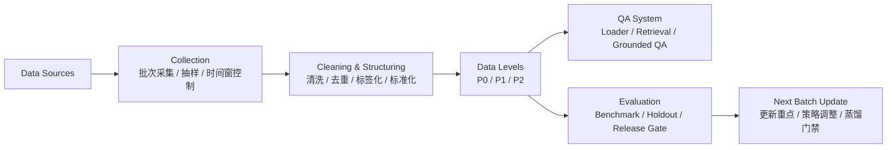

# 向 Prof 汇报 - 数据准备与数据流说明（简版）

## 1. 本次想汇报的问题
- 我们当前是否已经具备支撑 `QA` 课题的数据准备基础。
- 我们的数据维度是否已经收敛到能支撑当前场景，而不是停留在泛化讨论。
- 我们是否已经能够说明数据如何从源头进入系统，并形成后续评测和迭代闭环。

## 2. 当前结论
- 我们的课题已经收敛到 `QA` 场景，因此数据准备的重点不是做“大而全”的数据平台，而是建立一套能支撑问答、评测和后续迭代的最小数据闭环。
- 当前第一轮 `P0` 数据已经具备，能够支撑 MVP 问答系统的第一版工程实现。
- 我们当前最关键的工作，已经从“是否有数据”转向“如何稳定更新数据、如何让数据持续进入 QA 系统”。

## 3. 当前已经准备好的核心数据

| 表名 | 当前状态 | 作用 |
|---|---|---|
| `product_sku` | 已有 | 商品事实锚点 |
| `review_feedback` | 已有 | 用户反馈与口碑信号 |
| `trend_signal` | 已有 | 趋势与时效性信号 |
| `ingredient_knowledge` | 已有 | 科学护肤知识底座 |
| `compliance_rule` | 已有 v1 | 合规与风险底线 |

### 我们当前的判断
- 这五张 `P0` 表已经覆盖了当前 QA 场景需要的商品、反馈、趋势、知识和合规边界。
- 当前没有继续扩展到推荐系统或完整用户画像，这是有意收敛。

## 4. 我们如何理解“数据维度”
- `product_sku`：品牌、类目、价格带、上新时间、核心卖点
- `review_feedback`：来源、情感标签、效果标签、问题标签、时间
- `trend_signal`：关键词、趋势类型、时间窗、热度、增长率、平台
- `ingredient_knowledge`：成分名、INCI、功效、机理、风险标签、证据等级
- `compliance_rule`：规则类型、适用范围、限制值、警告信息、生效时间、来源条款

### 当前想说明的重点
- 我们不是只说“有商品数据、有评论数据”，而是已经明确每张表的核心维度，以及它们在 QA 系统中的角色。

## 5. 数据边界与分级
- `P0`：结构化、可共享、可检索、可评测
- `P1`：原始文本或更敏感细节，仅限受控使用
- `P2`：盲测与回归评测，不参与训练

### 当前意义
- 这套边界的作用是确保后续工程实现、评测和可能的蒸馏都建立在可控数据范围内。

## 6. 数据流处理过程

### 我们当前想强调的逻辑
- 数据不是静态文件，而是批次化进入系统。
- 所有数据会先经过采集、清洗和结构化，再进入 `P0/P1/P2` 分级。
- `P0` 既服务工程实现，也服务离线评测。
- 评测结果再反过来决定下一轮 batch 更新重点。

## 7. 当前的数据更新策略
- `product_sku`：周更 batch
- `review_feedback`：日更/双周打包
- `trend_signal`：日更 + 事件触发
- `ingredient_knowledge`：周更/月更
- `compliance_rule`：月更 + 政策触发

### 我们当前想表达的核心
- 我们的目标不是做一次性的 baseline，而是把数据准备成持续可更新的 batch 体系。

## 8. 当前已知不足
- `review_feedback.rating_bucket` 源字段缺失
- `trend_signal` 当前主要是月增长口径，还需要补 `7d/30d`
- `compliance_rule` 已完成 v1 结构化，但 taxonomy 仍需增强
- `P2` holdout 还没有完全冻结

## 9. 我们当前的 readiness 判断
- 课题已经从“方向讨论”进入“工程准备”阶段。
- 当前五张 `P0` 表和基本数据流已经成立。
- 下一个阶段最关键的不是继续扩场景，而是把 batch 更新、评测口径和数据闭环真正跑起来。

## 10. 我们希望老师看到的重点
- 我们已经把课题收敛到 `QA`
- 我们已经准备了支撑当前课题的五张 `P0` 表
- 我们已经明确数据维度和数据边界
- 我们已经能够说明数据如何进入系统以及如何持续更新

## 11. 一句话总结
- 对当前课题而言，只要数据准备、数据维度和数据流逻辑成立，工程实现和后续评测就有了稳定基础；这也是我们目前最核心的工作。
