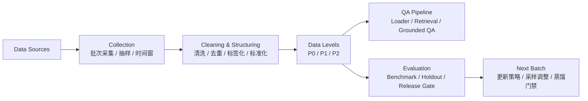

# 2026-03-25 数据准备与数据流说明

## 1. 项目定位与价值
- 项目定位：面向美妆护肤场景的 `retrieval-grounded QA`，同时满足科学正确性与趋势时效性。
- 核心矛盾：科学知识可靠但更新慢；趋势信号更新快但噪声高。
- 技术思路：多源检索 + 证据化回答 + 合规门禁，不做纯生成。
- 项目价值：学术上将“科学-趋势冲突”转化为可评测 QA 任务；工程上建立可复用 batch 闭环与评测门禁；应用上保证回答可解释、可追溯、可控风险。

## 2. docs 文件管理方式（当前状态）
- `docs/`：MVP 活跃文档，仅保留 01-11 主干文档。
- `docs/archive/`：历史快照（当前为 `2026-03-10-pre-mvp-reset/`）。
- `docs/progress/`：按日期记录阶段进展与汇报材料。
- `docs/feedback/20260306/`：导师沟通与 proposal 迭代材料。
- `docs/check-issue/`：任务包索引，映射 issue / 分支 / 交付。

## 3. 当前数据准备结论
- 第一轮 `P0` 基线已交付，可支撑 MVP 第一版工程实现。
- 数据准备重点已从“有没有数据”转为“如何稳定更新并进入评测闭环”。
- 当前范围有意收敛为 QA，不扩展到完整推荐系统与深度用户画像。

## 4. 当前 P0 数据（已落地批次）

| 表名 | 当前行数 | 作用 |
|---|---:|---|
| `product_sku` | 1000 | 商品事实锚点 |
| `review_feedback` | 29698 | 用户反馈与口碑信号 |
| `trend_signal` | 300 | 趋势与时效信号 |
| `ingredient_knowledge` | 8985 | 成分科学知识底座 |
| `compliance_rule` | 22231 | 合规与风险底线 |

数据来源：`data/deliveries/2026-03-14-baseline-v1/`

## 5. 数据维度与分级边界
- 维度最小集：
`product_sku`（品牌/类目/价格带/上新时间/核心卖点）、`review_feedback`（来源/情感/效果/问题标签/时间）、`trend_signal`（关键词/主题簇/热度/增长率/平台/采集时间）、`ingredient_knowledge`（成分名/INCI/功效/机理/风险/证据信息）、`compliance_rule`（规则类型/适用范围/限制值/警告/生效时间/条款来源）。
- 数据分级：
`P0`（结构化可共享，训练/检索/评测）、`P1`（受限原始明细，仅技术数据 owner）、`P2`（盲测集，仅评测不训练）。

## 6. 数据流主链路

## 7. 更新节奏与质量门槛
- 更新节奏：`product_sku` 周更，`review_feedback` 日更/双周打包，`trend_signal` 日更+事件触发，`ingredient_knowledge` 周更/月更，`compliance_rule` 月更+政策触发。
- 质量门槛：主键唯一性 `100%`，完整率 `>=95%`，重复率 `<=2%`，时间字段合法率 `>=98%`，趋势新鲜度 `<=7` 天。

## 8. 已知缺口（下一轮必须解决）
- `review_feedback.rating_bucket` 源字段缺失（当前回填 `unknown`）。
- `trend_signal` 仍以月窗口为主，需补 `7d/30d` 双窗口。
- `compliance_rule` 已完成 v1 结构化，taxonomy 仍需增强。
- `P2` holdout 尚未冻结完成。

## 9. 当前 readiness 判断
- 阶段判断：项目已进入“工程启动可执行”状态。
- 已具备：`P0` 五表、数据分级、批次交付、质量报告、数据流闭环设计。
- 下一步重心：稳定 batch 更新 + 冻结 `P2` + 跑通首轮 retrieval-grounded QA 与评测。

## 10. 结论
- 本项目当前的关键，是把既有数据闭环稳定运行。
- 数据准备、数据维度、数据流三件事已成立，已可支撑后续工程与评测推进。
